<h1 align="center">
  <br>
  📋 ClassAttend
  <br>
</h1>

<h4 align="center">A role-based attendance management system built for colleges & educational institutes.</h4>

<p align="center">
  
  
  
  
  
  
</p>

<p align="center">
  <a href="#-about">About</a> •
  <a href="#-screenshots">Screenshots</a> •
  <a href="#-tech-stack">Tech Stack</a> •
  <a href="#-roles--permissions">Roles</a> •
  <a href="#-features">Features</a> •
  <a href="#-installation">Installation</a> •
  <a href="#-roadmap">Roadmap</a>
</p>

---

## 📌 About

**ClassAttend** is a full-stack, role-based attendance management system designed to make college attendance **digital, accurate, and transparent**.

The system supports **three roles** — HOD, Teacher, and Student — each with their own permissions, dashboards, and data access, ensuring organized and secure management.

---

## 📸 Screenshots

### 🔐 Authentication

<table>
  <tr>
    <td align="center"><b>Login Page</b></td>
    <td align="center"><b>Register Page</b></td>
  </tr>
  <tr>
    <td>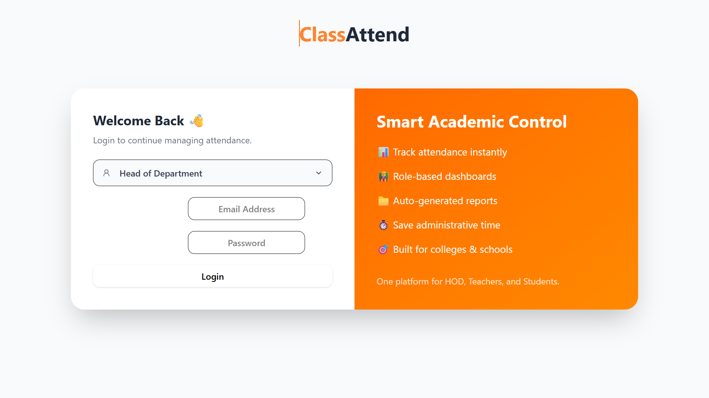</td>
    <td>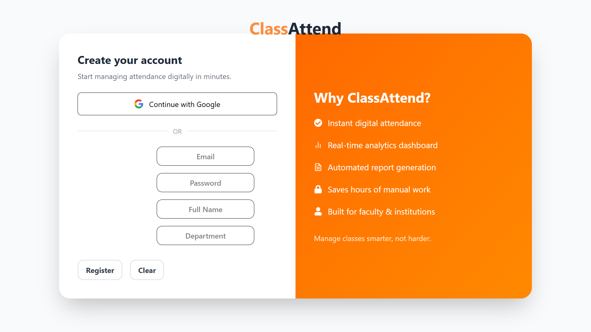</td>
  </tr>
</table>

---

### 👨‍💼 HOD Panel

<table>
  <tr>
    <td align="center"><b>HOD Dashboard — MCA Activity</b></td>
    <td align="center"><b>Attendance Records</b></td>
  </tr>
  <tr>
    <td>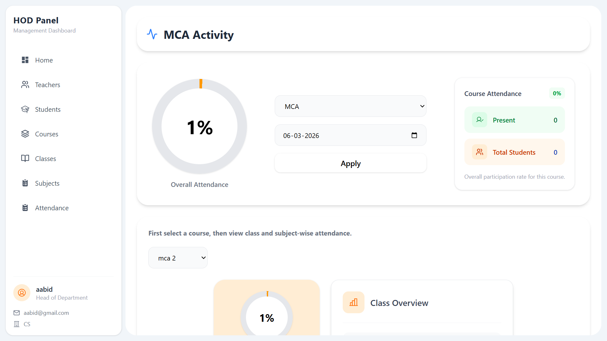</td>
    <td>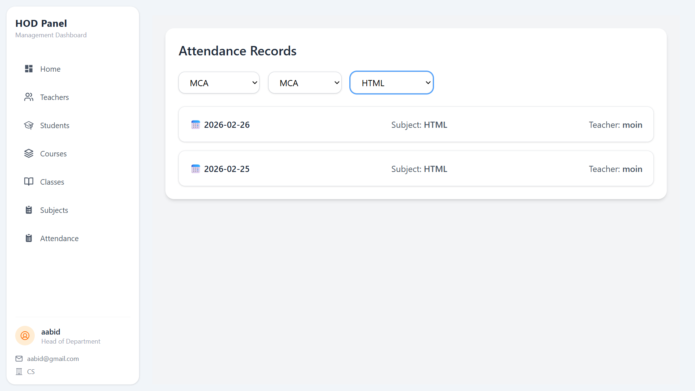</td>
  </tr>
  <tr>
    <td align="center"><b>Teacher Management</b></td>
    <td align="center"><b>Course Management</b></td>
  </tr>
  <tr>
    <td>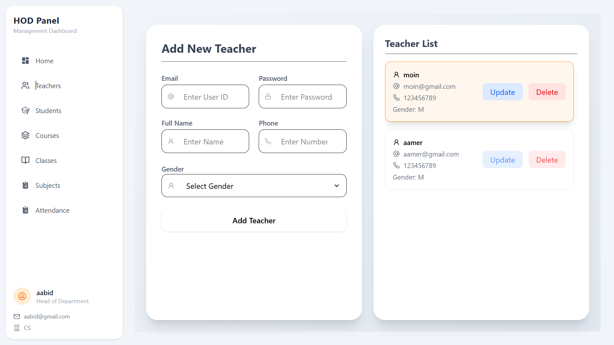</td>
    <td>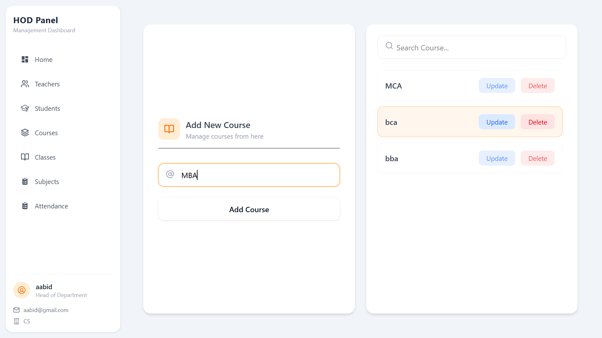</td>
  </tr>
  <tr>
    <td align="center"><b>Assign Teacher to Subject (Drag & Drop)</b></td>
    <td align="center"><b>Student Score Report</b></td>
  </tr>
  <tr>
    <td>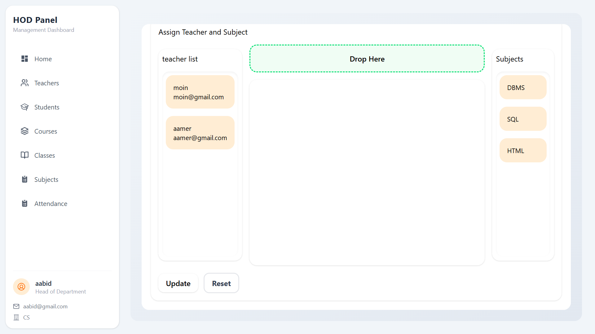</td>
    <td>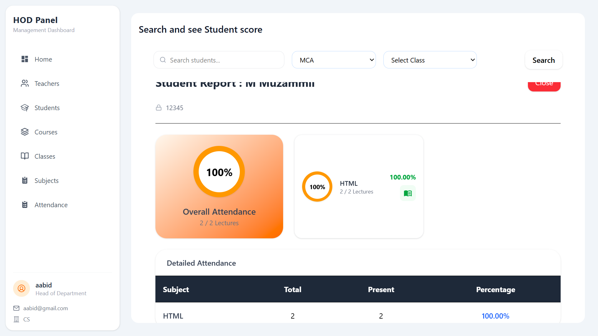</td>
  </tr>
</table>

---

### 👩‍🏫 Teacher Panel

<table>
  <tr>
    <td align="center"><b>Teacher Dashboard — Class Selection</b></td>
  </tr>
  <tr>
    <td>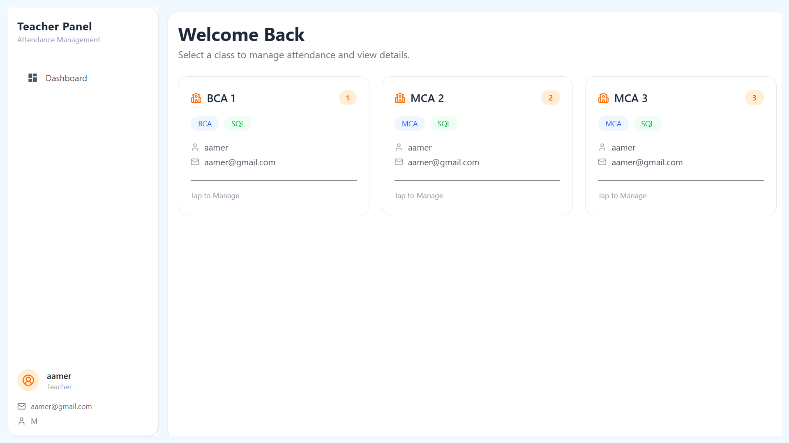</td>
  </tr>
  <tr>
    <td align="center"><b>Student Operations</b></td>
    <td align="center"><b>Attendance Management</b></td>
  </tr>
  <tr>
    <td>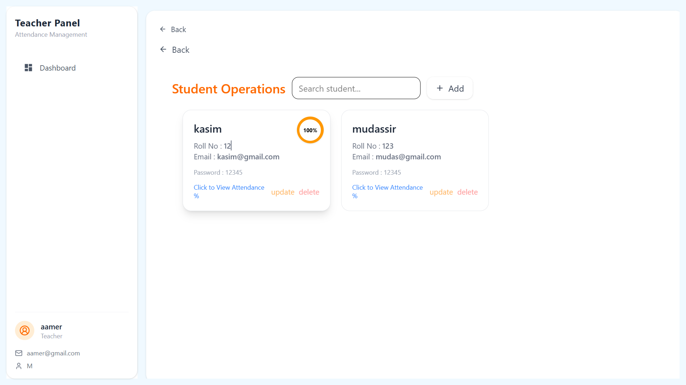</td>
    <td>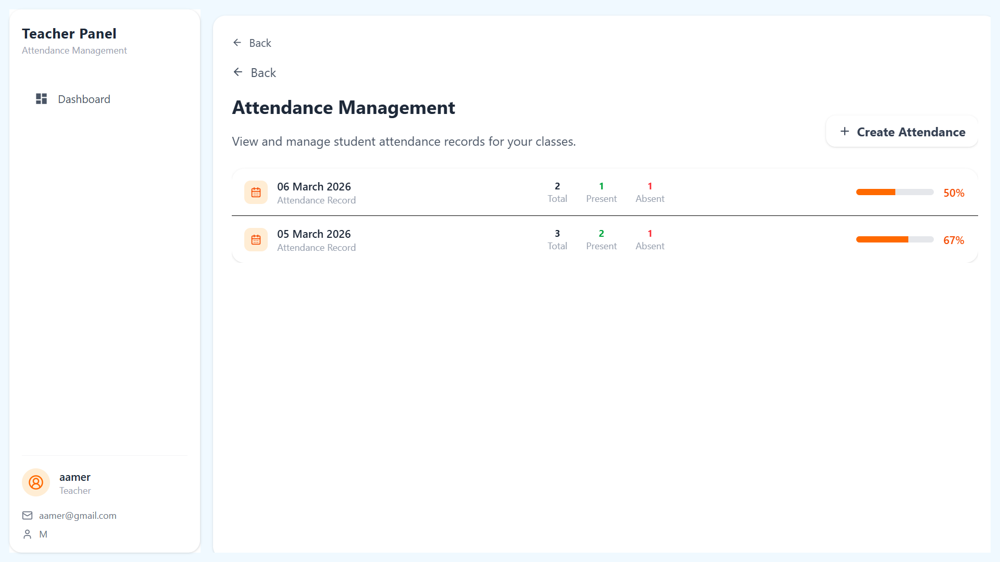</td>
  </tr>
  <tr>
    <td align="center" colspan="2"><b>Attendance Detail View — with CSV Download</b></td>
  </tr>
  <tr>
    <td colspan="2" align="center">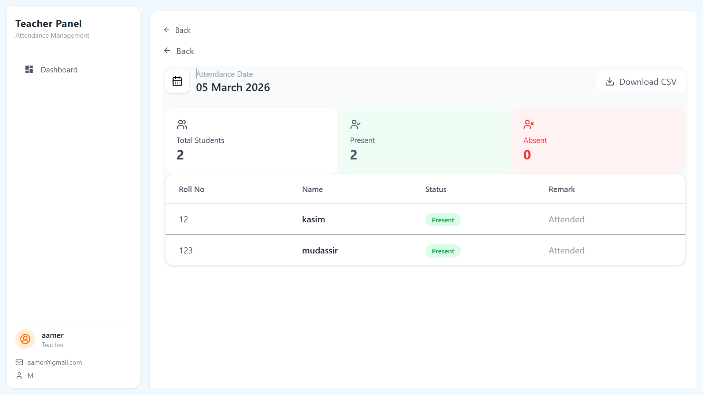</td>
  </tr>
</table>

---

### 👨‍🎓 Student Panel

<table>
  <tr>
    <td align="center"><b>Student Dashboard</b></td>
    <td align="center"><b>Subject Performance & Attendance History</b></td>
  </tr>
  <tr>
    <td>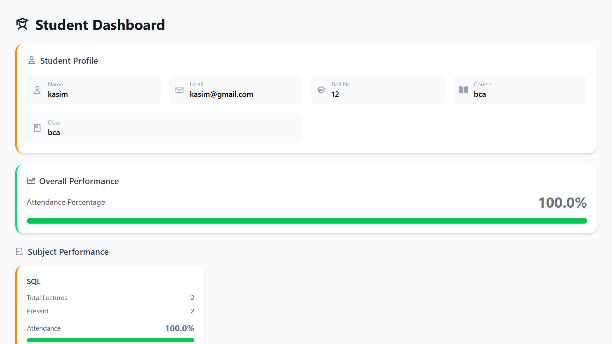</td>
    <td>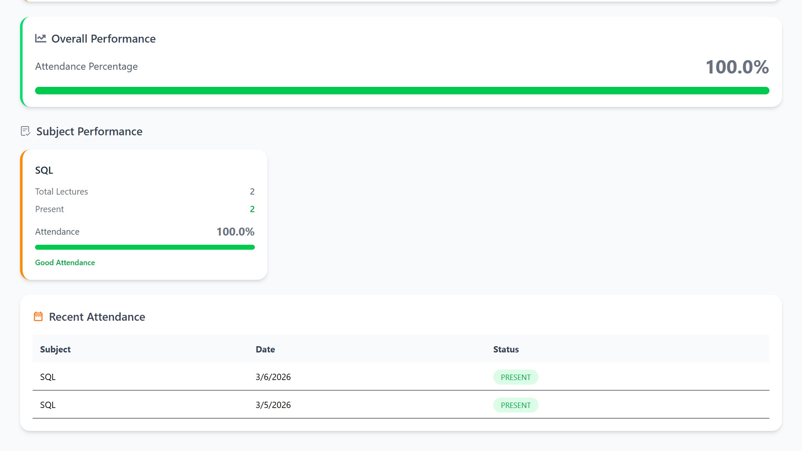</td>
  </tr>
</table>

---

## 🚀 Tech Stack

| Layer | Technologies |
|---|---|
| **Frontend** | React.js, Redux Toolkit, Tailwind CSS, Vite |
| **Backend** | Node.js, Express.js |
| **Database** | MySQL (TiDB Compatible) |
| **Auth** | JWT (JSON Web Tokens) |

---

## 👥 Roles & Permissions

### 👨‍💼 HOD — Admin Level
> Full system control and analytics

- Register / Login
- **Teacher Management** — Create, Read, Update, Delete
- **Student Management** — Create, Read, Update, Delete, Assign Class & Roll Number
- **Course Management** — Create, Read, Update, Delete
- **Class Management** — Create, Read, Update, Delete
- **Subject Management** — Create, Read, Update, Delete, Assign Teacher via drag & drop
- View attendance by Class / Course / Subject
- Download daily attendance reports
- View course-wise, class-wise, subject-wise, and student-wise scores

---

### 👩‍🏫 Teacher
> Attendance and student management

- Login
- **Student Management** — Create, Update, Delete, View attendance %
- **Attendance** — Mark date-wise attendance by class & subject
- Update and Delete attendance records
- Download attendance as CSV
- View student subject-wise scores

---

### 👨‍🎓 Student
> View and analyze personal attendance

- Login
- View overall attendance score with progress bar
- View subject-wise attendance breakdown
- View full attendance history with Present / Absent status
- Analyze subject-wise performance

---

## ✨ Features

- 🔐 **Role-Based Access Control (RBAC)** — 3 distinct roles with specific permissions
- 📅 **Date-wise & Subject-wise Attendance** — granular tracking for accurate records
- 📊 **Analytics** — class-wise, subject-wise, and student-wise performance views
- 📥 **CSV Report Download** — export attendance data by date, class, and subject
- 🔑 **JWT Authentication** — secure login for all three roles
- 🎯 **Drag & Drop** — assign teachers to subjects with intuitive drag-and-drop UI
- 📋 **Full CRUD** — complete management for all entities

---

## 🗄️ Database

> Attendance is stored **date-wise and subject-wise** for easier querying and analysis.

```
hods        teachers      students
courses     classes       subjects
attendance  roles
```

---

## 🗂️ Project Structure

```
ClassAttend/
├── Client/
│   ├── public/
│   └── src/
│       ├── assets/
│       ├── component/
│       ├── pages/
│       ├── redux/
│       ├── role/
│       ├── App.jsx
│       ├── main.jsx
│       └── index.css
│
├── Server/
│   ├── connections/
│   ├── controllers/
│   ├── db/
│   ├── middlewares/
│   ├── routes/
│   └── server.js
│
├── docs/
│   └── screenshots/        ← place all screenshots here
│
└── README.md
```

---

## ⚙️ Environment Variables

Create a `.env` file inside the `Server/` folder:

```env
TIDB_URL=your_database_connection_url
JWT_KEY=your_secret_key
PORT=8000
```

---

## 🛠️ Installation

**1. Clone the repository**

```bash
git clone https://github.com/your-username/ClassAttend.git
cd ClassAttend
```

**2. Backend Setup**

```bash
cd Server
npm install
npm run run
```

**3. Frontend Setup**

```bash
cd Client
npm install
npm run dev
```

---

## 🔁 Application Flow

```
HOD
 ├── Create Course
 ├── Create Class
 ├── Create Subject
 ├── Assign Teacher to Subject (drag & drop)
 └── Monitor Attendance & Analytics

Teacher
 ├── Select Class → Mark Attendance
 ├── Manage Students
 └── View & Download CSV Reports

Student
 └── View Attendance Score & Subject-wise Analysis
```

---

## 🚧 Roadmap

- [ ] 📊 Dashboard with interactive charts
- [ ] 📱 Mobile responsive UI
- [ ] 📄 PDF / Excel report exports
- [ ] 🔔 Low attendance alerts
- [ ] 🏫 Multi-college support
- [ ] 📧 Email notifications

---

## 👨‍💻 Developer

**M. Muzammil** — Full Stack Developer (React + Node.js)

[](https://www.linkedin.com/in/muzammil1244)

---

<p align="center">Built with ❤️ by <a href="https://www.linkedin.com/in/muzammil1244">M. Muzammil</a></p>
